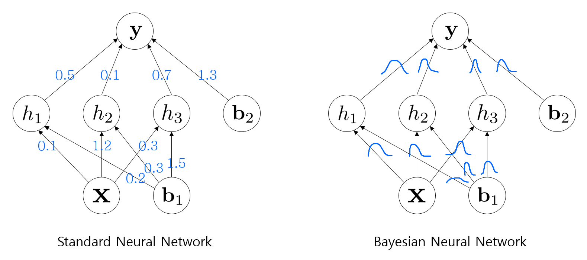
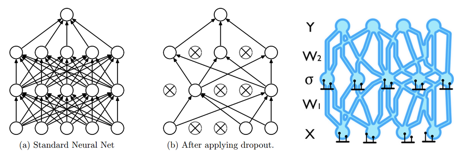
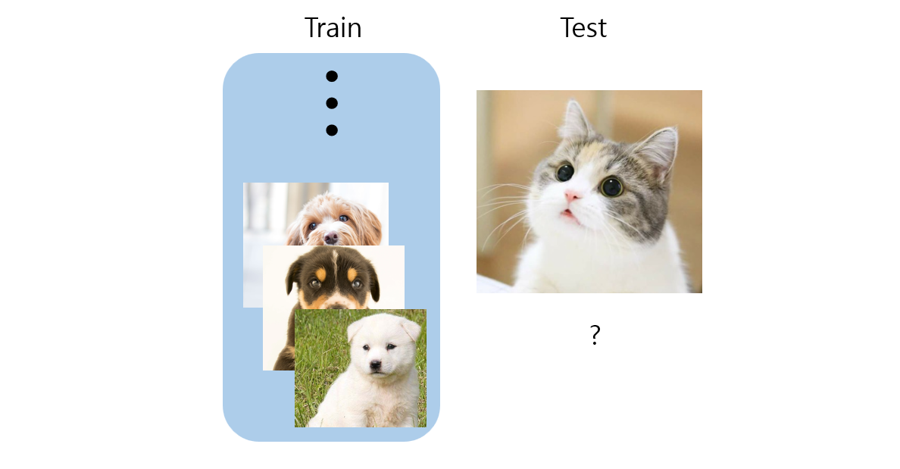
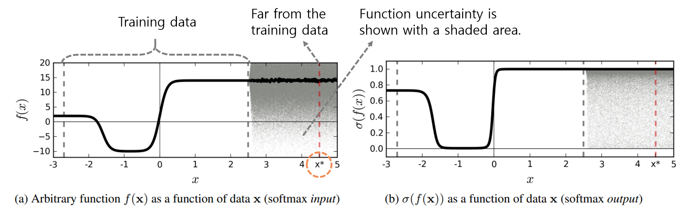
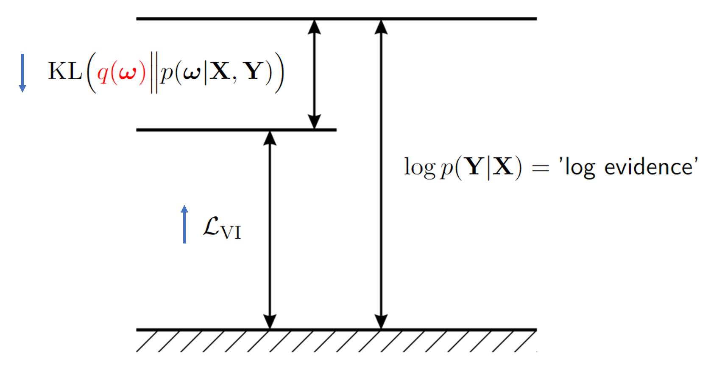

# Dropout as a bayesian approximation_representing model uncertainty in deep learning

- 박태준, 정몽주
- 공간통계연구실
- 2022년 8월

## Bayesian Neural Networks

- **Bayesian neural networks (BNNs, Bayesian NNs)** place a prior distribution over a neural network’s weights.
    $$p(\boldsymbol \omega)$$
- Bayesian neural networks offer a probabilistic interpretation of deep learning model.
    - **Model uncertainty**

## Dropout

- **Dropout** is used in many models in deep learning as a way to avoid over-fitting.
- The key idea is to randomly drop units (along with their connections) from the neural network during training.

## Topic
### Dropout as a Bayesian Approximation

- A neural network with dropout applied before every weight layer is mathematically equivalent to an approximation to a well known Bayesian model : the Gaussian process (GP).
- We develop tools for representing model uncertainty of existing dropout NNs.

# Introduction

### Model Uncertainty

- **Out of distribution test data:**
    - Given several pictures of dog breeds as training data
    - What should happen if a user uploads a photo of a cat and asks the website to decide on a dog breed?

- Softmax function converts a vector of K real numbers into a probability distribution of K possible outcomes.
- The softmax function is often used as the last activation function of a neural network to normalize the output of a network to a probability distribution over predicted output classes.

Figure: **A sketch of softmax input and output for an idealised binary classification problem.** Ignoring function uncertainty, point $x^\*$ is classified as class 1 with probability 1.

- Standard deep learning tools for regression and classification do not capture model uncertainty.

- Representing model uncertainty is of crucial importance.
- With model confidence at hand we can treat uncertain inputs and special cases explicitly.
    - For example, in the case of classification, a model might return a result with high uncertainty.
    - In this case, we might decide to pass the input to a human for classification.

# Background

### Notation

- $\mathbf x$: Vectors.
- $\mathbf X$: Matrices.
- $x$: scalar quantities.
- $\mathbf x_i$: Entire rows or columns.
- $x_{ij}$: Specific elements.

- $\mathbf W_1: Q\times K, ~\mathbf W_2: K\times D$: Variables.
- $\mathbf w_q, ~\mathbf w_k$: Corresponding lower case indices to refer to specific rows / columns for the first variable.
- $\mathbf w_k, ~\mathbf w_d$: For the second variable.

- $w_{1,qk}$: The element at row $q$ column $k$ of the variable $\mathbf W_1.$
- $w_{2,kd}$: The element at row $k$ column $d$ of the variable $\mathbf W_2.$

## Dropout

- Review the dropout NN model for the case of a single hidden layer NN.
- The generalization to multiple layers is straightforward.

- $\mathbf W_1 ~(Q\times K)$: The weight matrix connecting the first layer to the hidden layer.
- $\mathbf W_2 ~(K\times D)$: The weight matrix connecting connecting the hidden layer to the output layer.
- $\mathbf b$: The biases, $K$ dimensional vector.
- $\sigma(\cdot)$: Activation function, some element-wise non-linearity.

- **A standard NN model would output**: $$\hat{\mathbf y} = \sigma(\mathbf x \mathbf W_1 + \mathbf b) \mathbf W_2$$ given some input $\mathbf x.$

    - Note that we omit the outer-most bias term as this is equivalent to centring the output.

- Dropout is applied by sampling two binary vectors $\mathbf z_1, \mathbf z_2$ of dimensions $Q$ and $K$ respectively, with

    $$\mathbf z_{1,q}  \sim {\rm Bernoulli}(p_1) \text{for} q = 1, \cdots, Q,$$
    $$\mathbf z_{2,k}  \sim {\rm Bernoulli}(p_2) \text{for} k = 1, \cdots, K.$$
- Given an input $\mathbf x,$ $1 - p_1$ proportion of the elements of the input are set to zero: $$\mathbf x \circ \mathbf z_1.$$  
- **The dropout model’s output**: $$\hat{\mathbf{y}} = \sigma\Big( \mathbf x (\mathbf z_1 \mathbf W_1) + \mathbf b \Big)(\mathbf z_2 \mathbf W_2).$$
    - (We will write $\mathbf z_1$ when we mean ${\rm diag}(\mathbf z_1)$.)
    
- $\lbrace \mathbf x_1, \cdots, \mathbf x_N \rbrace$ : $N$ observed inputs.
- $\lbrace \mathbf y_1, \cdots, \mathbf y_N \rbrace$ : Corresponding observed outputs.
- $\lbrace \hat{ \mathbf y}_1, \cdots ,  \hat{\mathbf y}_N \rbrace$ : The outputs of the model.
- We often use $L_2$ regularization for parameters $\lbrace \mathbf W_1, \mathbf W_2, \mathbf b \rbrace$ weighted by some weight decays $\lambda_i$.
- **Minimization objective (cost)** for regression:
$$\mathcal L_{\rm dropout} := \dfrac{1}{2N} \sum^N_{n = 1} \Vert \mathbf{y}_n - \hat{\mathbf{y}}_n \Vert^2_2  + \lambda_1 \Vert \mathbf{W}_1 \Vert^2_2 + \lambda_2 \Vert \mathbf{W}_2 \Vert^2_2 + \lambda_3 \Vert \mathbf{W}_3 \Vert_2^2$$

## Gaussian Processes

- We use a **Gaussian process (GP)** to describe a distribution over functions.
- The Gaussian process offers desirable properties such as uncertainty estimates over the function values.

> **Definition(Gaussian Process)** A random process $X(t)$ is a \textbf{Gaussian process} if $\forall k \in \mathbb N,$ $\forall t_1, \cdots, t_k \in \mathcal T,$ a random vector formed by $X(t_1), \cdots, X(t_k)$ is jointly Gaussian.

- A Gaussian process is a collection of random variables, any finite number of which have a joint Gaussian distribution.
- The joint density is completely specified by
    - **Mean function**: $m(t) = \mathbb E[X(t)],$ where $m(\cdot)$ is known as a mean function.
    - **Covariance function**: $k(t,s) = \text{cov}(X(t), X(s)),$ where $k(\cdot, \cdot)$ is known as a covariance function.
- **Notation**: $X(t) \sim \mathcal{GP}(m(t), k(t,s))$

- $\lbrace \mathbf x_1, \cdots, \mathbf x_N \rbrace, \lbrace \mathbf y_1, \cdots, \mathbf y_N \rbrace$: Training dataset.
- $\mathbf X \in\mathbb R^{N \times Q}, \mathbf Y \in\mathbb R^{N\times D}$: Inputs and outputs.
- We would like to estimate a function $$\mathbf y = \mathbf f (\mathbf x)$$ that is likely to have generated our observation.
- Following the Bayesian approach, we would put some **prior distribution** over the space of functions $p(\mathbf f)$.
- We then look for the **posterior distribution** over the space of functions given our dataset  $$p(\mathbf f | \mathbf X, \mathbf Y) \propto p(\mathbf Y | \mathbf X, \mathbf f)p(\mathbf f).$$
- In our case the random variables represent the value of the function $\mathbf f(\mathbf x)$ at location $\mathbf x.$

> **Remark (Describe a distribution over functions)**
> - A Gaussian process is completely specified by its mean function and covariance function.
> - Define mean function and the covariance function of $\mathbf f(\mathbf x)$ as 
$$m(\mathbf x) = \mathbb E[\mathbf f(\mathbf x)]$$
$$k(\mathbb x, \mathbb x') = \mathbb E[(\mathbf f(\mathbf x) - m(\mathbf x)) (\mathbf f(\mathbf x') - m(\mathbf x'))^\top ]$$
> - Write the Gaussian process as $$\mathbf f(\mathbf x) \sim \mathcal{GP}(m(\mathbf x), k(\mathbf x, \mathbf x')).$$

- In practice, we place a joint Gaussian distribution over all function values 
$$\mathbf F | \mathbf X \sim \mathcal N (\mathbf 0, \mathbf K(\mathbf X, \mathbf X))$$
- To model the data we have to choose a covariance function $\mathbf K (\mathbf X_1, \mathbf X_2)$ for the Gaussian distribution.

## Variational Inference

- we could condition the model on a finite set of random variables $\omega$.
- Goal of a Bayesian neural network is to find a posterior distribution: $$p(\omega | \mathbf X, \mathbf Y) \propto p(\mathbf Y | \mathbf X, \omega) p(\omega)$$ where $\mathbf X$ and $\mathbf Y$ are the input and output training data and $\omega$ is a set of parameters of our interest.

- Once we have $p(\omega | \mathbf X, \mathbf Y)$, the output $\mathbf y^\*\in \mathbb R^D$ at unseen $\mathbf x^\* \in \mathbb R^Q$ is predicted as: $$p(\mathbf y^\* | \mathbf x^\*,\mathbf X,\mathbf Y) = \int p(\mathbf y^\* | \mathbf x^*\, \omega) p(\omega | \mathbf X, \mathbf Y) d\omega$$ called **the posterior predictive distribution** for a new $\mathbf x^\*.$

- In practice, none of them is tractable
- **Variational inference** is often used to handle this issue.
- The distribution $p(\omega | \mathbf X, \mathbf Y)$ cannot usually be evaluated analytically.
- Instead we define an approximating variational distribution $q(\omega)$, whose structure is easy to evaluate.

$$p(\mathbf y^* | \mathbf x^\*,\mathbf X,\mathbf Y) = \int p(\mathbf y^\* | \mathbf x^\*, \omega) \textcolor{red}{p(\omega | \mathbf X, \mathbf Y)} d\omega$$

$$\Downarrow$$

$$p(\mathbf y^\* | \mathbf x^\*,\mathbf X,\mathbf Y)  \approx \int p(\mathbf y^\* | \mathbf x^\*, \omega) \textcolor{red}{q(\omega)} d\omega$$

- Instead of finding $p(\omega | \mathbf X, \mathbf Y),$ optimize $q(\omega)$ by minimizing the Kullback–Leibler divergence $${\rm KL}\Big( \textcolor{red}{q(\omega)} \Big\Vert p(\omega | \mathbf X, \mathbf Y) \Big) = \int \textcolor{red}{q(\omega)} \log\dfrac{\textcolor{red}{q(\omega)}}{p(\omega | \mathbf X, \mathbf Y)} d\omega.$$

- ${\rm KL}( {q(\omega)} \Vert p(\omega | \mathbf X, \mathbf Y) )$ is not tractable as well.

- However, minimizing the Kullback–Leibler divergence is equivalent to maximizing the **log evidence lower bound (ELBO)**,

$$\mathcal L_{\rm VI}  := \int \textcolor{red}{q(\omega)} \log p(\mathbf Y | \mathbf X, \omega) d\omega - {\rm KL}\Big( \textcolor{red}{q(\omega)} \Big\Vert p(\omega) \Big)$$

$$\textcolor{gray}{\Big(}  \textcolor{gray}{\le \log p(\mathbf Y | \mathbf X) = \text{'log evidence'}\Big)}$$

with respect to the variational parameters defining $\textcolor{red}{q(\omega)}.$

- So in computing ELBO, we don't need to know $p(\omega | \mathbf X, \mathbf Y).$

$$\mathcal L_{\rm VI} = \int \textcolor{red}{q(\omega)} \log \textcolor{blue}{p(\mathbf Y | \mathbf X, \omega)} d\omega - {\rm KL}\Big( \textcolor{red}{q(\omega)} \Big\Vert \textcolor{cyan}{p(\omega)} \Big)$$

- All we need is 
    - Prior: $\textcolor{cyan}{p(\omega)}$  
    - Variational distribution: $\textcolor{red}{q(\omega)}$
    - Likelihood: $\textcolor{blue}{p(\mathbf Y | \mathbf X, \omega)}$
        - For defining likelihood function, we use a Gaussian process.
        - So we need a covariance function $\mathbf K(\cdot, \cdot).$

# Dropout as a Bayesian Approximation

- We will show that deep NNs with dropout applied before every weight layer are mathematically equivalent to approximate variational inference in the deep Gaussian process.
- Starting with the full Gaussian process we will develop an approximation optimization objective, $\mathcal L_{\rm GP-MC}$ , and show that 

$$\dfrac{\partial}{\partial \theta} \mathcal L_{\rm dropout}(\theta) = C \cdot \dfrac{\partial}{\partial \theta} \mathcal L_{\rm GP-MC}(\theta) \quad (\text{Equiv. in function})$$ 

for the parameters $\theta$ , some constant $C$.

## A Gaussian Process Approximation

- We begin by defining our covariance function: 
    $$\mathbf K (\mathbf x, \mathbf y) = \int p(\mathbf w)p(b)\sigma(\mathbf w^\top \mathbf x + b) \sigma(\mathbf w^\top \mathbf y + b) d\mathbf w db$$ where $p(\mathbf w)$ is a standard multivariate normal distribution of dimensionality $Q$ and $p(b)$ is a some distribution. 

- This defines a valid covariance function. (Tsuda et al., 2002)
- We use Monte Carlo integration with K terms:
    $$\hat{\mathbf K}(\mathbf x, \mathbf y) = \dfrac{1}{K} \sum^K_{k=1} \sigma(\mathbf w_k^\top \mathbf x + b_k) \sigma(\mathbf w_k^\top \mathbf y + b_k)$$ with $\mathbf w_k \sim p(\mathbf w), b_k \sim p(b).$ 
    
- $K$ will be the number of hidden units in our single hidden layer NN approximation.

- Using $\hat{\mathbf K}$ instead of $\mathbf K$ as the covariance function of the Gaussian process yields:

$$\mathbf w_k  \sim p(\mathbf w), b_k \sim p(b),$$

$$\mathbf W_1  = [\mathbf w_k]^K_{k=1}, \mathbf b = [b_k]^K_{k=1}$$

$$\hat{\mathbf K}(\mathbf x, \mathbf y)  = \dfrac{1}{K} \sum^K_{k=1} \sigma(\mathbf w_k^\top \mathbf x + b_k) \sigma(\mathbf w_k^\top \mathbf y + b_k)$$

$$\mathbf F | \mathbf X, \mathbf W_1, \mathbf b  \sim \mathcal N (\mathbf 0, \hat{\mathbf K}(\mathbf X, \mathbf X))$$

$$\mathbf y | \mathbf F  \sim \mathcal N(\mathbf F, \tau^{-1} \mathbf I_N),$$

with $\mathbf W_1$ a $Q\times K$ matrix parametrizing our covariance function.

- Suppose $\phi (\mathbf x) \in \mathbb R^{1\times K}$ is a hidden layer row vector coreesponding to $\mathbf x \in \mathbb R^Q:$ $$\phi (\mathbf x, \mathbf W_1, \mathbf b) = \sqrt{\dfrac{1}{K}} \sigma(\mathbf W_1^\top \mathbf x + \mathbf b)$$

- Then $$\Phi = [\phi(\mathbf x_n, \mathbf W_1, \mathbf b)]^N_{n=1}$$ is a $N\times K$ feature matrix.
- We have $$\hat{\mathbf K}(\mathbf X, \mathbf X) = \Phi \Phi ^\top.$$
- Then
    $$\mathbf y | \mathbf W_1, \mathbf b, \mathbf X \sim N(\mathbf 0, \Phi \Phi ^\top + \tau^{-1} \mathbf I_N) \quad \text{where} \mathbf y \in \mathbb R^{N\times 1}$$
    
    
    

- Assume that the output dimensions of a multi-output GP are independent.
- Introduce a $K \times 1$ auxiliary random variable $\mathbf w_d \sim \mathcal N (0, \mathbf I_K).$ Then $\mathbf y_d$ has the following:
$$\mathcal N (\mathbf y_d ;  0, \Phi\Phi^\top + \tau^{-1}\mathbf I_N ) = \int \mathcal N(\mathbf y_d ; \Phi \mathbf w_d, \tau^{-1}\mathbf I_N) \mathcal N(\mathbf w_d; 0,\mathbf I_K) d\mathbf w_d.$$

- Writing $\mathbf W_2 = [\mathbf w_d]^D_{d=1} \in \mathbb R ^{K \times D}$ then we finally have the following likelihood: 

$$p(\mathbf Y | \mathbf X) = \int p(\mathbf Y | \mathbf X, \mathbf W_1, \mathbf b) p(\mathbf W_1)p(\mathbf b)$$

$$= \int p(\mathbf Y | \mathbf X, \mathbf W_1, \mathbf W_2, \mathbf b) p(\mathbf W_1)p(\mathbf W_2)p(\mathbf b)$$

where the integration is w.r.t. $\mathbf W_1, \mathbf W_2, \mathbf b.$

## Log Evidence Lower Bound Optimization

- Define $q(\mathbf W_1, \mathbf W_2, \mathbf b) := q(\mathbf W_1)q(\mathbf W_2)q(\mathbf b)$ 
- Define $q(\mathbf W_1)$ and $q(\mathbf W_2)$ to be a Gaussian mixture distribution with two components, factorised over $Q$ and $K$.

$$q(\mathbf W_1) = \prod_{q=1}^Q q(\mathbf w_d), \quad q(\mathbf W_2) = \prod_{k=1}^K q(\mathbf w_k)$$

$$q(\mathbf w_q) = p_1 N(\mathbf m_q, \mathbf \sigma^2 \mathbf I_K) + (1 - p_1) N(0, \mathbf \sigma^2 \mathbf I_K)$$

$$q(\mathbf w_k) = p_2 N(\mathbf m_k, \mathbf \sigma^2 \mathbf I_D) + (1 - p_2) N(0, \mathbf \sigma^2 \mathbf I_D)$$

with some probability $p_1, p_2 \in [0, 1]$, scalar $\mathbf \sigma > 0$ and $\mathbf m_q \in \mathbb{R}^K$.

- $\displaystyle q(\mathbf b) = N(\mathbf m, \mathbf \sigma^2 \mathbf I_K)$.

- Now, recall ELBO: 
- $$\mathcal L_{\rm VI} = \int \textcolor{red}{q(\omega)} \log \textcolor{blue}{p(\mathbf Y | \mathbf X, \omega)} d\omega - {\rm KL}\Big( \textcolor{red}{q(\omega)} \Big\Vert \textcolor{cyan}{p(\omega)} \Big)$$

- To sum up, we have 

$$\mathcal L_{\rm GP-VI} = \int \textcolor{red}{q(\mathbf W_1, \mathbf W_2, \mathbf b)} \log \textcolor{blue}{p(\mathbf Y | \mathbf X, \mathbf W_1, \mathbf W_2, \mathbf b)} - {\rm KL}\Big( \textcolor{red}{q(\mathbf W_1, \mathbf W_2, \mathbf b)} \Big\Vert \textcolor{cyan}{p(\mathbf W_1, \mathbf W_2, \mathbf b)} \Big)$$

$$= \textcolor{blue}{\sum^N_{n=1}} \int \textcolor{red}{q(\mathbf W_1, \mathbf W_2, \mathbf b)} \log \textcolor{blue}{p(\mathbf y_n | \mathbf x_n, \mathbf W_1, \mathbf W_2, \mathbf b) } - {\rm KL}\Big( \textcolor{red}{q(\mathbf W_1, \mathbf W_2, \mathbf b)} \Big\Vert \textcolor{cyan}{p(\mathbf W_1, \mathbf W_2, \mathbf b)} \Big)$$

- Rewrite the $\log p(\mathbf Y |\mathbf X, \mathbf W_1, \mathbf W_2, \mathbf b)$ as a sum :

$$\log p(\mathbf Y |\mathbf X, \mathbf W_1, \mathbf W_2, \mathbf b) = \sum_{d=1}^D \log N(\mathbf y_d; \Phi\mathbf w_d, \tau^{-1}\mathbf I_N)$$

$$= -\frac{\tau}{2}\sum_{d=1}^D \| \mathbf y_d-\Phi\mathbf w_d\|_2^2 + C$$

$$= -\frac{\tau}{2}\sum_{n=1}^N \| \mathbf y_n-\hat{\mathbf y}_n\|_2^2 + C$$

$$= \sum_{n=1}^N \log N(\mathbf y_n; \phi(x_n, \mathbf W_1, \mathbf b)\mathbf W_2, \tau^{-1}\mathbf I_D),$$

where $\hat{\mathbf y}_n = \phi(x_n, \mathbf W_1,\mathbf b)\mathbf W_2.$

- We estimate each integral using Monte Carlo integration:

$$\mathcal L_{\rm GP-MC} := \sum^N_{n=1}   \log {p(\mathbf y_n | \mathbf x_n, \mathbf W_1, \mathbf W_2, \mathbf b)} - {\rm KL}\Big( \textcolor{red}{q(\mathbf W_1, \mathbf W_2, \mathbf b)} \Big\Vert \textcolor{cyan}{p(\mathbf W_1, \mathbf W_2, \mathbf b)} \Big)$$

with realizations

$$\mathbf W_1  = \mathbf z_1(\mathbf M_1 + \boldsymbol \sigma \boldsymbol \epsilon_1) + (1 - \mathbf z_1) \boldsymbol \sigma \widehat{\boldsymbol \epsilon}_1,$$

$$\mathbf W_2  = \mathbf z_2(\mathbf M_2 + \boldsymbol \sigma \boldsymbol \epsilon_2) + (1 - \mathbf z_2) \boldsymbol \sigma \widehat{\boldsymbol \epsilon}_2,$$

$$\mathbf b  = \mathbf m + \boldsymbol \sigma \boldsymbol \epsilon,$$

where

$$\boldsymbol\epsilon_1  \sim \mathcal N (\mathbf 0 ,\mathbf I _{Q\times K}), \mathbf z_{1,q}  \sim {\rm Bernoulli}(p_1) $$

$$\boldsymbol\epsilon_2  \sim \mathcal N (\mathbf 0 ,\mathbf I _{K\times D}), \mathbf z_{2,q}  \sim {\rm Bernoulli}(p_2)$$

- Then, We can re-write $\mathcal L_{\rm GP-VI}$ as

$$\textcolor{blue}{\sum^N_{n=1}} \int \textcolor{red}{q(\mathbf z_1,\boldsymbol\epsilon_1 ,\mathbf z_2, \boldsymbol \epsilon_2, \boldsymbol \epsilon)} \log \textcolor{blue}{p(\mathbf Y | \mathbf X, \mathbf W_1(\mathbf z_1, \boldsymbol\epsilon_1), \mathbf W_2(\mathbf z_2, \boldsymbol\epsilon_2), \mathbf b (\boldsymbol \epsilon))}  - {\rm KL}\Big( \textcolor{red}{q(\mathbf W_1, \mathbf W_2, \mathbf b)} \Big\Vert \textcolor{cyan}{p(\mathbf W_1, \mathbf W_2, \mathbf b)} \Big)$$

where each integration is over $\boldsymbol\epsilon_1, \mathbf z_1, \boldsymbol\epsilon_2, \mathbf z_2,\boldsymbol\epsilon.$

- Estimate each integral using MC integration with a distinct single sample to obtain :
$$\mathcal L_{\rm GP-VI} = \sum_{n=1}^N \log p(\mathbf y_n|\mathbf x_n, \hat{\mathbf W}_1^n, \hat{\mathbf W}_2^n, \hat{\mathbf b}^n) - {\rm KL}\left( q(\mathbf W_1, \mathbf W_2, \mathbf b) || p(\mathbf W_1, \mathbf W_2, \mathbf b) \right)$$

- Optimising the stochastic objective $\mathcal L_{\rm GP-MC}$ we would converge to the same limit as $\mathcal L_{\rm GP-VI}$.

- We can’t evaluate the KL divergence term between a mixture of Gaussians and a single Gaussian analytically.

- However we can perform Monte Carlo integration like in the above.

- Letting $\boldsymbol \sigma \rightarrow 0,$ then  

$$\widehat{\mathbf W}_1^n \approx \hat{\mathbf z}^n_1 \mathbf M_1, \widehat{\mathbf W}_2^n\approx\hat{\mathbf z}^n_2 \mathbf M_2,\, \widehat{\mathbf b}^n, \approx \mathbf m$$

$$\hat{\mathbf y}_n \approx \sqrt{\frac{1}{n}}\sigma\left(\mathbf x_n(\hat{\mathbf z}_1^n\mathbf M_1) + \mathbf m \right) \hat{\mathbf z}_2^n\mathbf M_2$$

- With Gaussian prior on the parameters $\mathbf W1$, $\mathbf W2$, and $\mathbf b_1$, we obtain the maximization objective:

$$\mathcal L_{\rm GP-MC} \propto -  \dfrac{\tau}{2} \sum^N_{n=1}   \Vert \mathbf y_n - \hat{\mathbf y}_n \Vert^2_2 - {\rm KL}\Big( \textcolor{red}{q(\mathbf W_1, \mathbf W_2, \mathbf b)} \Big\Vert \textcolor{cyan}{p(\mathbf W_1, \mathbf W_2, \mathbf b)} \Big) $$

$$\approx  -  \dfrac{\tau}{2} \sum^N_{n=1}   \Vert \mathbf y_n - \hat{\mathbf y}_n \Vert^2_2  - \dfrac{p_1}{2} \Vert \mathbf M_1 \Vert^2_2 - \dfrac{p_2}{2} \Vert \mathbf M_2 ||^2_2  - \dfrac{1}{2} \Vert \mathbf m \Vert^2_2$$

- Note that Abused notation $A \propto B$ to mean $A = B+c$ rather than $A = cB$ for some constant $c,$ in this paper.
    
    
- So, Maximising $\mathcal L_{\rm GP-MC}$ results in the same optimal parameters as the minimisation of $\mathcal L_{\rm dropout}$ :

$$\dfrac{\partial}{\partial \theta} \mathcal L_{\rm dropout}(\theta) = - \dfrac{1}{\tau N} \dfrac{\partial}{\partial \theta} \mathcal L_{\rm GP-MC}(\theta)$$ 
    
for the parameters $\theta.$

## Going Deepper than a Single Hidden Layer
### How to extend the derivation to two hidden layers?

- Define a different covariance function for the GPs in the 2nd layers :

$$\mathbf K_2(\mathbf x, \mathbf y) = \frac{1}{K_2} \int p(\mathbf b_2)\sigma_2(\mathbf x + \mathbf b_2)^{\top}\sigma_2(\mathbf y + \mathbf b_2)d\mathbf b_2$$
with some distribution $p(\mathbf b_2)$ over $\mathbf b_2 \in \mathbb R^{K_2}$.

- We use MC integration with one term :

$$\hat{\mathbf K}_2(\mathbf x, \mathbf y) = \frac{1}{K_2}\sigma_2(\mathbf x + \mathbf b_2)^{\top}\sigma_2(\mathbf y + \mathbf b_2)$$

- We generate the model's output

$$\mathbf F_1 | \mathbf X, \mathbf W_1, \mathbf b_1  \sim \mathcal N(\mathbf 0, \hat{\mathbf K}_1 (\mathbf X, \mathbf X))$$

$$\mathbf F_2 | \mathbf X, \mathbf b _2 \sim\mathcal N(\mathbf 0, \hat{\mathbf K}_2 (\mathbf F_1, \mathbf F_1))$$

$$\mathbf Y | \mathbf F_2 \sim\mathcal N(\mathbf F_2, \tau^{-1}\mathbf I_N)$$

- We introduce auxiliary random variables $\mathbf W_2 \in \mathbb R^{K_1 \times K_2},~\mathbf W_3 \in \mathbb R^{K_2 \times D}.$ The columns of each matrix distribute according to $\mathcal N (0, \mathbf I)$

- Like before, write $\hat{\mathbf K}_1(\mathbf X, \mathbf X) = \Phi_1\Phi_1^{\top}$ with $\Phi_1 \in \mathbb R^{N \times K_1}$, then we can write $\mathbf F_1 = \Phi_1 \mathbf W_2$.

- Let $\hat{\mathbf K}_2(\mathbf X, \mathbf X) = \Phi_2\Phi_2^{\top}$ with $\Phi_2 \in \mathbb R^{N \times K_2}$ :

- Finally, we can write 
    $$\mathbf y_n | \mathbf X, \mathbf W_1, \mathbf b_1, \mathbf W_2, \mathbf b_2, \mathbf W_3 \sim \mathcal{N}(\mathbf W_3^{\top}\phi_{2,n},\, \tau^{-1}\mathbf I_D)$$

# Obtaining Model Uncertainty

- Recall that the **approximate predictive distribution:**
$$q(\mathbf y^\* | \mathbf x^\*) = \int p(\mathbf y^\* | \mathbf x^\*, \omega)q(\omega) d\omega$$ where $\omega = \{ \mathbf W_i \}^L_{i=1}$ is our set of random variables for a model with $L$ layers.

- We sample $T$ sets of vectors of realizations from the Bernoulli distribution $\lbrace \mathbf z^t_1, \cdots, \mathbf z^t_L \rbrace^T_{t=1}$ 
with $\mathbf z_i^t = [ \mathbf z^t_{i, j} ]^{K_i}_{j=1}$ 
 
,giving $\lbrace \mathbf W^t_1, \cdots, \mathbf W^t_L \rbrace^T_{t=1}.$

- We estimate the first moment:
$$\mathbb E_{q(\mathbf y^\* | \mathbf x^\*)} [ \mathbf y^\*]  = \int \mathbf y^\* q(\mathbf y^\* | \mathbf x^\*) d\mathbf y^\*$$
$$\approx \dfrac{1}{T} \sum^T_{i=1} \hat{\mathbf y}^\*(\mathbf x^\*, \mathbf W^t_1, \cdots, \mathbf W^t_L ),$$

called **MC dropout**.

- We estimate the second moment:
$$\mathbb E_{q(\mathbf y^\* | \mathbf x^\*)}  [(\mathbf y^\*)^\top (\mathbf y^\*)] \approx \tau^{-1}\mathbf I_D + \dfrac{1}{T} \sum^T_{t=1} \hat{\mathbf y}^\*(\mathbf x^\*, \mathbf W^t_1, \cdots, \mathbf W^t_L )^\top \hat{\mathbf y}^\*(\mathbf x^\*, \mathbf W^t_1, \cdots, \mathbf W^t_L )$$

- The model's predictive variance:

$$var_{q(\mathbf y^\* \vert \mathbf x^\*)}(\mathbf y^\*) \approx \tau^{-1}\mathbf I_D + \dfrac{1}{T} \sum^T_{t=1} \hat{\mathbf y}^\*(\mathbf x^\*, \mathbf W^t_1, \cdots, \mathbf W^t_L )^\top \hat{\mathbf y}^\*(\mathbf x^\*, \mathbf W^t_1, \cdots, \mathbf W^t_L ) - \mathbb E_{q(\mathbf y^\* \vert \mathbf x^\*)} (\mathbf y^\*)^\top \mathbb E_{q(\mathbf y^\* \vert \mathbf x^\*)} \mathbf y^\*$$

- $\hat{\mathbf y}^\*(\mathbf x^\*, \mathbf W^t_1, \cdots, \mathbf W^t_L ) = \mathbf f^{\omega}(\mathbf x^\*)$
- The **first moment** can be estimated as follows:

> **Proposition (in tesis)**
> Given $p(\mathbf y^\* | \mathbf f^{\omega}(\mathbf x^\*) ) = \mathcal N(\mathbf y^\* ; \mathbf f^{\omega}(\mathbf x^\*), \tau^{-1}\mathbf I)$ for some $\tau > 0,$ $\mathbb E_{q(\mathbf y^\* | \mathbf x^\*)}\mathbf y^\*$ can be estimated with the unbiased estimator 
> 
> $$\tilde{\mathbb E}\mathbf y^\* : = \dfrac{1}{T} \sum^T_{t = 1} \mathbf f^{\hat{\omega}_t} (\mathbf x^\*)$$
> 
> $$\rightarrow \mathbb E_{q(\mathbf y^\* \vert \mathbf x^\*)} [\mathbf y^\*]$$ as $T \rightarrow \infty$
> 
> , with $\hat{\omega}_t \sim q(\omega).$
 

- We estimate the **second raw moment** (for regression) using the following proposition:

> Proposition (in thesis)
> Given $p(\mathbf y^\* | \mathbf f^{\omega}(\mathbf x^\*) ) = \mathcal N(\mathbf y^\* ; \mathbf f^{\omega}(\mathbf x^\*), \tau^{-1}\mathbf I)$ for some $\tau > 0,$ $\mathbb E_{q(\mathbf y^\* | \mathbf x^\*)}[(\mathbf y^\*)^\top (\mathbf y^\*)]$ can be estimated with the unbiased estimator 
> $$\tilde{\mathbb E}[(\mathbf y^\*)^\top (\mathbf y^\*)] : = \tau^{-1} \mathbf I  + \dfrac{1}{T} \sum^T_{t = 1} \mathbf f^{\hat{\omega}_t} (\mathbf x^\*) ^\top \mathbf f^{\hat{\omega}_t} (\mathbf x^\*)$$
> 
> $$\rightarrow \mathbb E_{q(\mathbf y^\* \vert \mathbf x^\*)} [(\mathbf y^\*)^\top (\mathbf y^\*)]$$ as $T \rightarrow \infty$

- Note that the dropout NN model itself is not changed.
- As a result, this information can be used with existing NN models trained with dropout.

# Experiments
