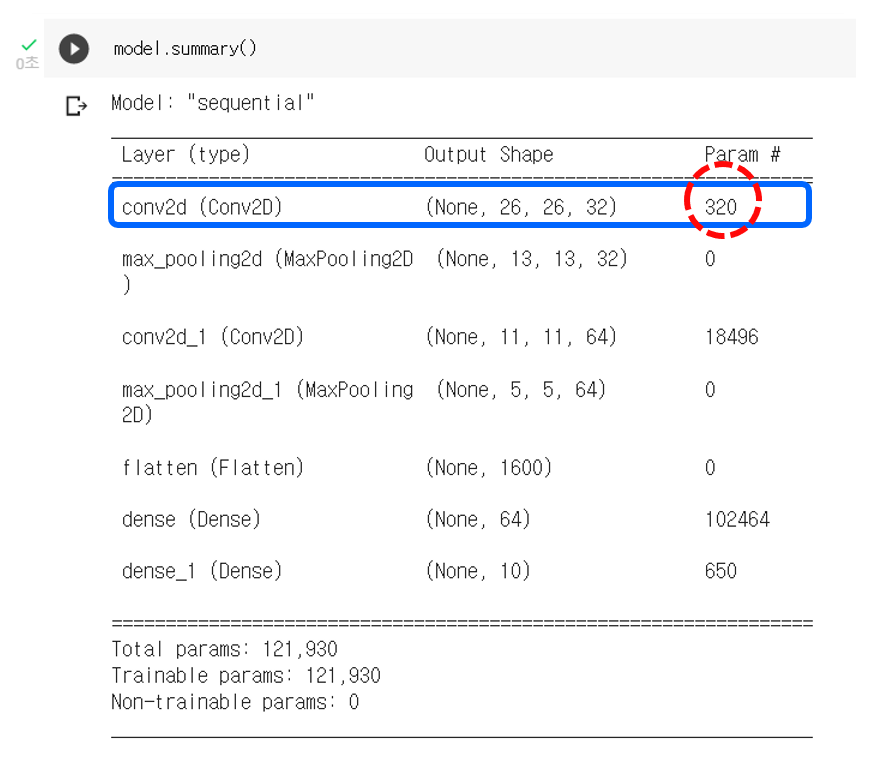

# Bayesian Convolutional Neural Networks with Bernoulli Approximate Variational Inference

- 박태준, 정몽주
- 공간통계연구실
- 2022년 8월

# 1. Introduction

- **Convolutional neural networks (CNNs)** are popular deep learning tool for image processing.
- CNNs require huge amounts of data for regularisation and quickly over-fit on small data.
- In contrast **Bayesian neural networks (NNs)** are robust to over-fitting, offer uncertainty estimates, and can easily learn from small datasets.
- Because of the vast number of parameters and extremely large models commonly used in practical applications.
- However, modelling a distribution over the kernels (also known as filters) of a CNN has never been attempted successfully before.

- **Dropout** is often not used after convolution layers.
- In existing literature, dropout is used in CNNs only after inner-product layers
- Because test error suffers, which renders small dataset modelling a difficult task.

- We propose new practical dropout CNN architectures, mathematically identical to Bayesian CNN
- Our model is implemented by performing dropout after convolution layers.
- We show these models obtain better test accuracy compared to existing approaches in the field.
- We show that the proposed model reduces over-fitting on small datasets compared to standard techniques.
- We demonstrate improved results with MC dropout on existing CNN models in the literature.

### Topic: Bayesian CNN with Variational Inference
- Casting dropout as variational inference in Bayesian neural networks.
- This Bayesian interpretation of dropout allows us to propose the use of MC dropout for convolutions.

# 2. Bayesian Convolutional Neural Networks
## Convolutional Neural Networks (CNNs)
- This section introduces **convolutional neural networks**, also known as **convnets**.
- CNNs is a type of deep-learning model almost universally used in computer vision applications.

- Convolution layers learn local patterns.
- It gives two properties:
    - The patterns they learn are translation invariant.    
    - They can learn spatial hierarchies of patterns.

> The visual world forms a spatial hierarchy of visual modules.

- We will look at a simple MNIST digits classification example to understand the structure of CNNs.

> The **MNIST database** is a large database of handwritten digits containing 60,000 training images and 10,000 testing images.

- Convolutions operate over 3D tensors, called **feature maps:**
$${\rm (height, width, channels)}$$
$\rightarrow$ Spatial axes and depth axis.

- In the MNIST example, the first convolution layer takes a feature map of size (28, 28, 1).

### Structure of CNNs

### Two Convolution layers

- The convolution operation extracts \textbf{patches} from its input feature map 
- $\Rightarrow$ and applies the same transformation to all of these patches, using \textbf{filters}, producing an output feature map. 

- A convolution works by sliding these windows of size 3 × 3 or 5 × 5 over the 3D input feature map, and extracting the 3D patch of shape *(window height, window width, input depth)*

- Each such 3D patch is then transformed into a 1D vector of shape *(output depth,)*

    - via a tensor product with the same learned **weight matrix**, called the convolution kernel.

### Max-Pooling

- Over-fitting

- Translation invariant.

# To implementing a Bayesian CNN, how to apply dropout after all convolution layers?
## Bayesian Convolutional Neural Networks

- To integrate over the kernels, we reformulate the convolution as a linear operation.

- Input to the layer: $$\mathbf x \in \mathbb R^{28 \times 28 \times 1}.$$

- Kernels: $$\mathbf k_1, \cdots , \mathbf k_{32} \in \mathbb R^{3 \times 3 \times 1}.$$

- We extract $3 \times 3 \times 1$ dimensional patches from the input and vectorize these.

- Collecting the vectors in the rows of a matrix, we obtain a new representation for our input $$\bar{\mathbf x} \in \mathbb R^{676 \times 9},$$ with $n = 26 \cdot 26 = 676$ patches.

- The vectorized kernels form the columns of the \textbf{weight matrix}:
    $$\mathbf W_1 \in \mathbb R^{9 \times 32}.$$

The convolution operation is then equivalent to the matrix product: $$\bar{\mathbf x} \mathbf W_1 \in \mathbb R^{676 \times 32}.$$

- The columns of the output can be re-arranged to a 3 dimensional tensor:
    $$\mathbf y \in \mathbb R^{26 \times 26 \times 32}.$$

- Pooling can then be seen as a non-linear operation on the matrix $\mathbf y$. 

- We place a prior distribution over each kernel.

- We sample Bernoulli random variables $\mathbf z_{i, j, n}$ and multiply 
    by the weight matrix $$\mathbf W_i \cdot {\rm diag}\Big( [\mathbf z_{i,j,n}]^{K_i}_{j=1} \Big)$$ 
    with $K_i$ channels in the $i$'th layer.

- This distribution randomly sets kernels to zero for different patches.
- This is also equivalent to applying dropout for each element in the tensor $\mathbf y$ before pooling.

- Therefore, implementing our Bayesian CNN is as simple as using dropout after every convolution layer before pooling.

> Recall that:
> - To relate the approximate inference in our Bayesian NN to dropout training, we define our approximating variational distribution $q(\mathbf W_i)$ for every layer $i$ as $$\mathbf W_i  = \mathbf M_i \cdot {\rm diag}( [\mathbf z_{i,j}]^{K_i}_{j=1} )$$ $$\mathbf z_{i,j} \sim {\rm Bernoulli} (p_i) ,  i = 1, \cdots, L, ~ j = 1, \cdots, K_{i-1}$$
>   - Here $\mathbf z_{i, j}$ are Bernoulli distributed random variables with some probability $p_i.$
>   - $\mathbf M_i$ are variational parameters to be optimized.

- The standard dropout test time approximation does not perform well when dropout is applied after convolutions.
- We solve this by approximating the predictive distribution

> - Recall that: 
> $$p(y^* | \mathbf x^*, \mathbf X, \mathbf Y)  \approx \int p(y^* | \mathbf x^* , \omega) q(\omega) d\omega$$ 
> $$\approx \dfrac{1}{T} \sum^T_{t = 1} p(y^* | \mathbf x^*, \hat{\omega}_t)$$

# 3. Experiments

- Two sets of data
    - MNIST
    - CIFAR10
        - $32\times32$ pixel, 60,000 color images
        - Labeled with 10 classes

- **Testing techniques with dropout**

    - Standard dropout
    - MC dropout

- Text error for LeNet with dropout applied after every weight layer (lanet-all our Bayesian CNN implementation), dropout applied after the fully connected layer alone (lanet-ip), and without dropout (lanet-none).

- Test error of CIFAR10 with the same networks evaluated using Standard dropout versus MC dropout ($T=100$, averaged with 5 repetitions and given with standard deviation.

- Augmented-DSN test error for different number of averaged forward passes in MC dropout (blue) averaged with 5 repetitions, shown with 1 standard deviation. In green is test error with Standard dropout.

- Test error of CIFAR10 with the same networks evaluated using Standard dropout versus MC dropout ($T=100$, averaged with 5 repetitions and given with standard deviation.)

---

# Reference

- FRANÇOIS CHOLLET, Deep Learning with Python. 2017
- Yarin Gal, Dropout as a Bayesian Approximation: Appendix. 2016
