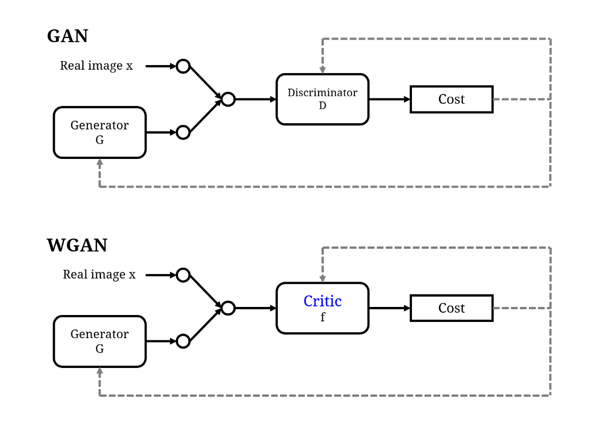
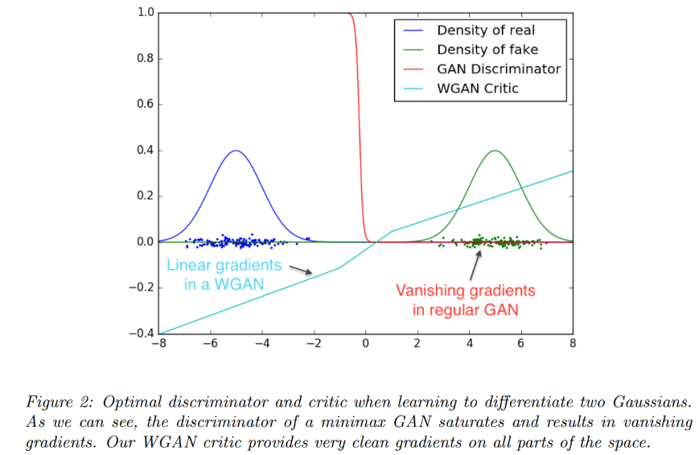
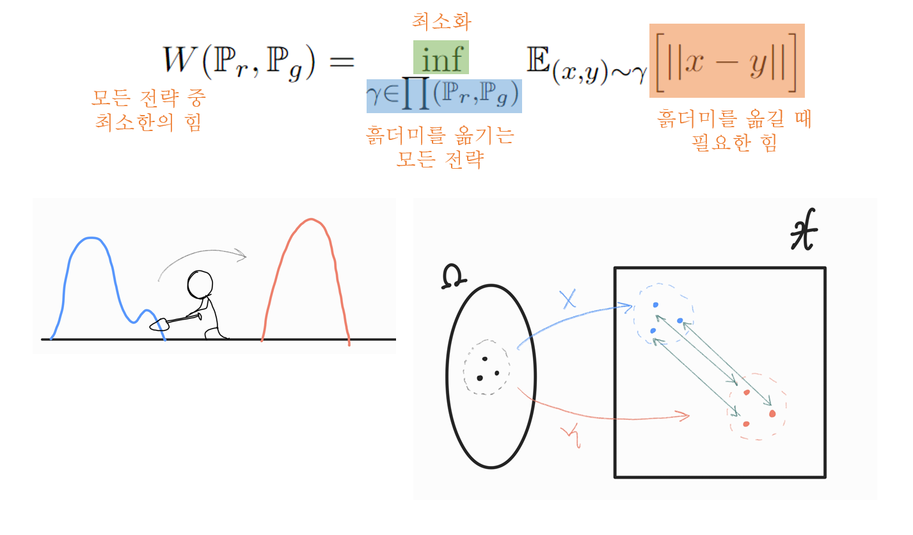

# Wasserstein GAN

- 박태준, 신준호
- 공간통계연구실
- 2022년 7월 5일

## Topic

## GAN의 문제점

- Minimizing the GAN objective function with an optimal discriminator, $D^*$, is equivalent to minimizing the JS-divergence;

$$\min_G V(D^*, G) = 2JS(\mathbb P_r, \mathbb P_\theta) - 2\log2$$

- **Claim:** Divergence, which is not continuous with the generator's parameter, leads to difficulty in learning.

### Training GANs is hard for theoretical reasons with the GAN cost functions.
> *Arjovsky et al., (2017), Towards principled methods for training Generative Adversarial Networks.*

- When $\mathbb P_r$ and $\mathbb P_\theta$ lie on low dimensional manifolds, there's always a perfect discriminator that can be trained well.
- It provides no usable gradients. ( $\nabla D^*(x)$ will be 0 for almost everywhere.)
  - Gradient vanishing:
    $$\nabla_{\theta_g} \log \Big( 1 - D(G(z^{(i)})) \Big)  \rightarrow 0$$
    under optimal discriminator. ( $D$ is close to $D^*$)
  - Mode collapse:
    $$-\nabla_{\theta_g}\log D(G(z^{(i)}))$$ 
    $$\textit{unstable with large variance of gradients.}$$

### Discriminator vs Critic

- No longer have to worry about the fast learning of the discriminator.
- The gradient is smoother everywhere and learns better even the generator is not producing good images.

## Introduction

- We focus on the ways to measure how close $\mathbb P_\theta$ is to $\mathbb P_r$ ; 
$$\rho(\mathbb P_\theta, \mathbb P_r)$$
- The most fundamental difference:
    Their impact on the convergence of sequence of probability distribution.
- Note that: 
    A sequence of distribution $(\mathbb P_t)_{t\in \mathbb N}$ **converges**
    
    $\Leftrightarrow$ $^\exists \mathbb P_{\infty}$ s.t. $\rho(\mathbb P_t, \mathbb P_{\infty})$ tends to 0.
    
    - We want to find a weaker metric $\rho$.

- In order to optimize the parameter $\theta$ , it is desirable to define our model
distribution $\mathbb P_\theta$ in a manner that makes the mapping $\theta \mapsto \mathbb P_\theta$ continuous.

- **Continuity:** when a sequence of parameters $\theta_t$ converges to $\theta,$ the distribution $\mathbb P_{\theta_t}$ also converge to $\mathbb P_\theta.$

  - It depends on the way we compute the distance between distributions.

- The main reason we care about the mapping $\theta \mapsto \mathbb P_\theta$ to be continuous: 
  - we would like to have a loss function $\theta \mapsto \rho(\mathbb p_\theta, \mathbb P_r)$ that is continuous, and this is equivalent to having the mapping $\theta \mapsto \mathbb p_\theta$ be continuous.

    
> Note that for $f: \{ \theta_\alpha \} \rightarrow \{\mathbb P_\beta \}$ , $f(\theta) = \mathbb P_\theta$ , $f(\theta)$ is continuous if
 $$\forall \text{open } V \subset \{ \mathbb P_\beta \}, f^{-1}(V) \text{ is also open in } \{\theta_\alpha \}$$
For the topology on the metric space $M = (\{\mathbb P_\beta\}, \rho )$,  $g(\theta) = \rho(\mathbb P_\theta, \mathbb P_r)$ is continuous, if $f(\theta)$ is continuous. Since for $h(\mathbb P_\theta) = \rho(\mathbb P_\theta, \mathbb P_r), g(\theta) = h(f(\theta))$ and distance function $h$ is continuous. So,
$$\forall W \in M, g^{-1}(V) = f^{-1} (h^{-1}(W)) \text{ is also open in } \{\theta_\alpha \}.$$

### 논문의 기여

- GAN의 Discriminator보다 선생님 역할을 잘 할 수 있는 Critic을 사용함으로써 Gradient를 잘 전달시키고 Critic과 Generator를 최적점까지 학습할 수 있다. 
- 따라서 아래와 같은 이점을 얻을 수 있다.
  - During training, you do not have to care about the balance between the discriminator and generator.
  - Mode dropping, a common problem in GAN, can be solved.

## Different Distances

### Notation

- $\mathcal X:$ a compact metric set. (such as the space of images $[0, 1]^d$ )
- $\Sigma:$ the set of all Borel subsets of $\mathcal X.$
- $\text{Prob}(\mathcal X):$ the space of probability measures definded on $\mathcal X.$

We now define elementary distances and divergences between two distributions $\mathbb P_r, \mathbb P_g \in \text{Prob}(\mathcal X).$

- **The Total Variation (TV) distance:**
    $$\delta(\mathbb P_r, \mathbb P_g) = \sup_{A \in \Sigma} |\mathbb P_r(A) - \mathbb P_g(A) |$$
    

- **The Kullback-Leibler (KL) divergence:**
$$KL(\mathbb P_r || \mathbb P_g) = \int \log \left( \dfrac{P_r(x)}{P_g(x)} \right) P_r(x) d\mu(x),$$ where both $\mathbb P_r, \mathbb P_g$ are assumed to be absolutely continuous.

- **The Jensen-Shannon (JS) divergence:**
$JS(\mathbb P_r, \mathbb P_g) = KL(\mathbb P_r || \mathbb P_m) + KL(\mathbb P_g || \mathbb P_m),$$ where $\mathbb P_m$ is the mixture $(\mathbb P_r + \mathbb P_g)/2$

- **The Earth-Mover (EM) distance or Wasserstein-1:**
$$W(\mathbb P_r , \mathbb P_g) = \inf_{\gamma \in \prod (\mathbb P_r, \mathbb P_g)} \mathbb E_{(x,y) \sim \gamma}\Big[ || x - y || \Big],$$
where $\prod (\mathbb P_r, \mathbb P_g)$ denotes the set of all joint distributions $\gamma(x,y)$ whose marginals are respectively $\mathbb P_r$ and $\mathbb P_g.$

  1. Intuitively, γ(x, y) indicates how much “mass” must be transported from $x$ to $y$ in order to transform the distributions $\mathbb P_r$ into the distribution $\mathbb P_g$.
  2. The EM distance then is the “cost” of the optimal transport plan.

### Example: Learning parallel lines
Let $Z \sim U[0,1]$. Let $\mathbb P_0$ be the distribution of $(0,Z) \in \mathbb R^2$ , 
%uniform on a straight vertical line passing through the origin. 
Now let $g_\theta (z) = (\theta, z)$ with $\theta$ a single real parameter. In this case,

- $W(\mathbb P_0, \mathbb P_\theta) = |\theta|$
- $JS(\mathbb P_0, \mathbb P_\theta) =  \log 2 \text{ if } \theta \ne 0, \\  0  \text{ if } \theta = 0 $
- $KL(\mathbb P_\theta || \mathbb P_0) = KL(\mathbb P_0 || \mathbb P_\theta) =  +\infty  \text{ if } \theta \ne 0, \\ 0  \text{ if } \theta = 0 $
- $\delta(\mathbb P_0, \mathbb P_\theta) = 1  \text{ if }  \theta \ne 0, \\ 0  \text{ if } \theta = 0$

