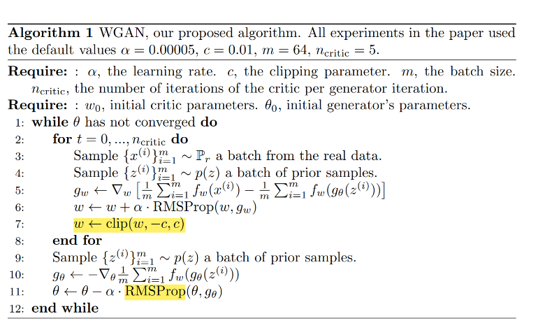
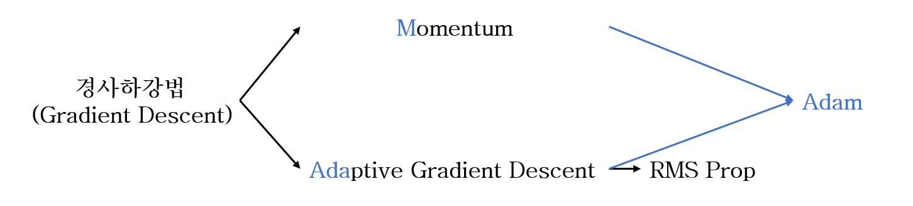
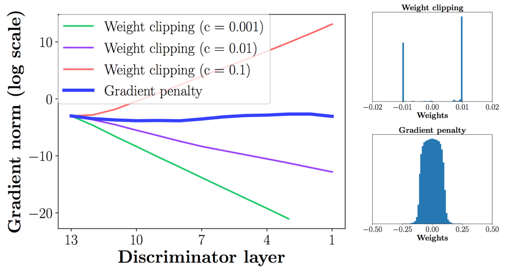

# Wasserstein GAN

- 박태준, 신준호
- 공간통계연구실
- 2022년 7월 5일

## Topic

## GAN의 문제점

- Minimizing the GAN objective function with an optimal discriminator, $D^*$, is equivalent to minimizing the JS-divergence;

$$\min_G V(D^*, G) = 2JS(\mathbb P_r, \mathbb P_\theta) - 2\log2$$

- **Claim:** Divergence, which is not continuous with the generator's parameter, leads to difficulty in learning.

### Training GANs is hard for theoretical reasons with the GAN cost functions.
> *Arjovsky et al., (2017), Towards principled methods for training Generative Adversarial Networks.*

- When $\mathbb P_r$ and $\mathbb P_\theta$ lie on low dimensional manifolds, there's always a perfect discriminator that can be trained well.
- It provides no usable gradients. ( $\nabla D^*(x)$ will be 0 for almost everywhere.)
  - Gradient vanishing:
    $$\nabla_{\theta_g} \log \Big( 1 - D(G(z^{(i)})) \Big)  \rightarrow 0$$
    under optimal discriminator. ( $D$ is close to $D^*$)
  - Mode collapse:
    $$-\nabla_{\theta_g}\log D(G(z^{(i)}))$$ 
    $$\textit{unstable with large variance of gradients.}$$

### Discriminator vs Critic

- No longer have to worry about the fast learning of the discriminator.
- The gradient is smoother everywhere and learns better even the generator is not producing good images.

## Introduction

- We focus on the ways to measure how close $\mathbb P_\theta$ is to $\mathbb P_r$ ; 
$$\rho(\mathbb P_\theta, \mathbb P_r)$$
- The most fundamental difference:
    Their impact on the convergence of sequence of probability distribution.
- Note that: 
    A sequence of distribution $(\mathbb P_t)_{t\in \mathbb N}$ **converges**
    
    $\Leftrightarrow$ $^\exists \mathbb P_{\infty}$ s.t. $\rho(\mathbb P_t, \mathbb P_{\infty})$ tends to 0.
    
    - We want to find a weaker metric $\rho$.

- In order to optimize the parameter $\theta$ , it is desirable to define our model
distribution $\mathbb P_\theta$ in a manner that makes the mapping $\theta \mapsto \mathbb P_\theta$ continuous.

- **Continuity:** when a sequence of parameters $\theta_t$ converges to $\theta,$ the distribution $\mathbb P_{\theta_t}$ also converge to $\mathbb P_\theta.$

  - It depends on the way we compute the distance between distributions.

- The main reason we care about the mapping $\theta \mapsto \mathbb P_\theta$ to be continuous: 
  - we would like to have a loss function $\theta \mapsto \rho(\mathbb p_\theta, \mathbb P_r)$ that is continuous, and this is equivalent to having the mapping $\theta \mapsto \mathbb p_\theta$ be continuous.

    
> Note that for $f: \{ \theta_\alpha \} \rightarrow \{\mathbb P_\beta \}$ , $f(\theta) = \mathbb P_\theta$ , $f(\theta)$ is continuous if
 $$\forall \text{open } V \subset \{ \mathbb P_\beta \}, f^{-1}(V) \text{ is also open in } \{\theta_\alpha \}$$
For the topology on the metric space $M = (\{\mathbb P_\beta\}, \rho )$,  $g(\theta) = \rho(\mathbb P_\theta, \mathbb P_r)$ is continuous, if $f(\theta)$ is continuous. Since for $h(\mathbb P_\theta) = \rho(\mathbb P_\theta, \mathbb P_r), g(\theta) = h(f(\theta))$ and distance function $h$ is continuous. So,
$$\forall W \in M, g^{-1}(V) = f^{-1} (h^{-1}(W)) \text{ is also open in } \{\theta_\alpha \}.$$

### 논문의 기여

- GAN의 Discriminator보다 선생님 역할을 잘 할 수 있는 Critic을 사용함으로써 Gradient를 잘 전달시키고 Critic과 Generator를 최적점까지 학습할 수 있다. 
- 따라서 아래와 같은 이점을 얻을 수 있다.
  - During training, you do not have to care about the balance between the discriminator and generator.
  - Mode dropping, a common problem in GAN, can be solved.

## Different Distances

### Notation

- $\mathcal X:$ a compact metric set. (such as the space of images $[0, 1]^d$ )
- $\Sigma:$ the set of all Borel subsets of $\mathcal X.$
- $\text{Prob}(\mathcal X):$ the space of probability measures definded on $\mathcal X.$

We now define elementary distances and divergences between two distributions $\mathbb P_r, \mathbb P_g \in \text{Prob}(\mathcal X).$

- **The Total Variation (TV) distance:**
    $$\delta(\mathbb P_r, \mathbb P_g) = \sup_{A \in \Sigma} |\mathbb P_r(A) - \mathbb P_g(A) |$$
    

- **The Kullback-Leibler (KL) divergence:**
$$KL(\mathbb P_r || \mathbb P_g) = \int \log \left( \dfrac{P_r(x)}{P_g(x)} \right) P_r(x) d\mu(x),$$ where both $\mathbb P_r, \mathbb P_g$ are assumed to be absolutely continuous.

- **The Jensen-Shannon (JS) divergence:**
$JS(\mathbb P_r, \mathbb P_g) = KL(\mathbb P_r || \mathbb P_m) + KL(\mathbb P_g || \mathbb P_m),$$ where $\mathbb P_m$ is the mixture $(\mathbb P_r + \mathbb P_g)/2$

- **The Earth-Mover (EM) distance or Wasserstein-1:**
$$W(\mathbb P_r , \mathbb P_g) = \inf_{\gamma \in \prod (\mathbb P_r, \mathbb P_g)} \mathbb E_{(x,y) \sim \gamma}\Big[ || x - y || \Big],$$
where $\prod (\mathbb P_r, \mathbb P_g)$ denotes the set of all joint distributions $\gamma(x,y)$ whose marginals are respectively $\mathbb P_r$ and $\mathbb P_g.$

  1. Intuitively, γ(x, y) indicates how much “mass” must be transported from $x$ to $y$ in order to transform the distributions $\mathbb P_r$ into the distribution $\mathbb P_g$.
  2. The EM distance then is the “cost” of the optimal transport plan.

### Example: Learning parallel lines
Let $Z \sim U[0,1]$. Let $\mathbb P_0$ be the distribution of $(0,Z) \in \mathbb R^2$ , 
%uniform on a straight vertical line passing through the origin. 
Now let $g_\theta (z) = (\theta, z)$ with $\theta$ a single real parameter. In this case,

- $W(\mathbb P_0, \mathbb P_\theta) = |\theta|$
- $JS(\mathbb P_0, \mathbb P_\theta) =  \log 2 \text{ if } \theta \ne 0, \\  0  \text{ if } \theta = 0 $
- $KL(\mathbb P_\theta || \mathbb P_0) = KL(\mathbb P_0 || \mathbb P_\theta) =  +\infty  \text{ if } \theta \ne 0, \\ 0  \text{ if } \theta = 0 $
- $\delta(\mathbb P_0, \mathbb P_\theta) = 1  \text{ if }  \theta \ne 0, \\ 0  \text{ if } \theta = 0$

### Wasserstein distance is indeed a distance

- Obviously symmetric.
- Existence theorem for optimal coupling implies the identity of indiscernibles.
- Gluing lemma can be applied to show the triangle inequality.

### Theorem 1
Let $\mathbb P_r$ be a fixed distribution over a compact metric space $\mathcal{X}$ . Let $Z$ be a random variable over another space $\mathcal{Z}$. Let  $g:\mathcal{Z}\times\mathbb{R}^d\rightarrow\mathcal{X}$ be a function, that will be denoted as $g_\theta(z)$. Let $\mathbb P_\theta$ denote the distribution of $g_\theta(Z)$. 
Then
  1. If $g$ is continuous in $\theta$, so is $W(\mathbb P_r,\mathbb P_\theta)$.
  2. If $g$ is locally Lipschitz with local Lipschitz constants $L(\theta,z)$ satisfying $\mathbb{E}[L(\theta,Z)]<+\infty$ , then $W(\mathbb P_r,\mathbb P_\theta)$ is continuous everywhere, and differentiable almost everywhere.
  3. Statements 1 and 2 are false for the Jensen-Shannon divergence and all the $KL$ s.
  
### Corollary 1
Let $g_\theta$ be any feedforward neural network parametrized by $\theta$ and $\mathbb{E}[\|Z\|]<\infty$. Then conditions for Theorem 1 are satisfied.

### Theorem 2
Let $\mathbb P$ be a distribution on a compact space $\mathcal X$ and $(\mathbb P_n)_{n\in\mathbb N}$ be a sequence of distributions on $\mathcal X$. Then, considering all limits as $n \rightarrow \infty$,

1. The following statements are equivalent.

  * $\delta(\mathbb P_n, \mathbb P)\rightarrow 0$ with $\delta$ the total variation distance.
  * $JS(\mathbb P_n,\mathbb P) \rightarrow 0$ with $JS$ the Jensen-Shannon divergence.

2. The following statements are equivalent.

  * $W(\mathbb P_n,\mathbb P)\rightarrow 0$.
  * $\mathbb P_n \xrightarrow[]{\mathcal D}\mathbb P$ where $\xrightarrow[]{\mathcal D}$ represents convergence in distribution for random variables.

3. $KL(\mathbb P_n\Vert \mathbb P)\rightarrow 0$ or $KL(\mathbb P \Vert \mathbb P_n)\rightarrow 0$ imply the statements in 1.
4. The statements in 1 imply the statements in 2.

## Wasserstein GAN

- If $c$ is a **distance** on some metric space $\mathcal{X}$, then a $c$-convex function is just a 1-Lipschitz function, and it is its own $c$-transform.
- Thus we have 
$$W( \mathbb P_r, \mathbb P_\theta ) = \sup_{\vert f\vert_L \le 1} \{  \mathbb E_{x \sim \mathbb P_r}[ f(x) ] - \mathbb E_{x\sim\mathbb P_\theta}[ f(x) ] \}$$
        
### Theorem 3

Let $\mathbb P_r$ be any distribution. Let $\mathbb P_\theta$ be the distribution of $g_\theta(Z)$ with $Z$ a random variable with density $p$ and $g_\theta$ a function satisfying the condition in the previous theorem. Then for each $\theta = \theta^\*,$ there is a solution $f:\mathcal  X \rightarrow \mathbb R$ to the above problem and we have
$$\nabla_\theta W( \mathbb P_r, \mathbb P_\theta ) \vert_{\theta = \theta^\*} = -\mathbb E( \nabla_\theta f(g_\theta(Z)) \vert_{\theta = \theta^\*} ). $$

### 정리

(1). $W(\mathbb P_r , \mathbb P_g) = \inf_{\gamma \in \prod (\mathbb P_r, \mathbb P_g)} \mathbb E_{(x,y) \sim \gamma}[ || x - y || ]$

(2). $W(\mathbb P_r,\mathbb P_\theta) = \sup_{\vert f \vert_L \le 1} (  \mathbb E_{x \sim \mathbb P_r}[f(x)] -\mathbb E_{x \sim \mathbb P_\theta}[ f(x) ] )$

(3). $\max_{w \in \mathcal W} \mathbb E_{x \sim \mathbb P_r}[f_w(x)] - \mathbb E_{z\sim p(z)}[f_w(g_\theta(z))]$ where $\{f_w \}_{w\in \mathcal W}$ are all $K$-Lipschitz for some $K$.

- $W(\mathbb p_r , \mathbb p_g) = \inf_{\gamma \in \prod (\mathbb p_r, \mathbb p_g)} \mathbb E_{(x,y) \sim \gamma}[ \Vert x - y \Vert ]$
- $K\cdot W(\mathbb p_r , \mathbb p_g) = \inf_{\gamma \in \prod (\mathbb p_r, \mathbb p_g)} \mathbb E_{(x,y) \sim \gamma}[K \cdot \Vert x - y \Vert ]$

- Then,
$W(\mathbb p_r, \mathbb p_\theta) = \sup_{\Vert f\Vert_L \le 1}\{ \mathbb E_{x \sim \mathbb p_r}[f(x)] - \mathbb E_{x\sim \mathbb p_\theta}[f(x)] \}$ and
- $K \cdot W(\mathbb p_r, \mathbb p_\theta) = \sup_{\Vert f \Vert_L \le K}\{ \mathbb E_{x \sim \mathbb p_r}[f(x)] - \mathbb E_{x\sim \mathbb p_\theta}[f(x)] \}$ by Kantorovich-Rubinstein duality.

  - If we replace $\Vert f \Vert_L \le 1 \text{ for } \Vert f \Vert_L \le K$ ( $K$-Lipschitz for some constant $K$ ), then we end up with $K\cdot W(\mathbb p_r, \mathbb p_\theta)$. 

- If we have a parameterized family of functions $(f_w){w \in \mathcal W}$ that are all $K$ -Lipschitz for some $K$ , we could consider solving the problem
$\max_{w \in \mathcal W} \mathbb E_{x \sim \mathbb p_r}[f_w(x)] - \mathbb E_{z\sim p(z)}[f_w(g_\theta(z))]$

  - This process would yield a calculation of $W(\mathbb p_r, \mathbb p_\theta)$.
  - We could consider differentiating $W(\mathbb p_r, \mathbb p_\theta)$ by back-prop through (2) via estimating $\mathbb E_{z\sim p(z)}[\nabla_\theta f_w(g_\theta (z))]$
  - $f_w$: $K$-Lipschitz $\dashrightarrow$ 'Weight Clipping'

### Algorithm

### RMSProp

$$w \leftarrow w + \alpha \cdot \text{RMSProp}(w, g_w)$$

$$\theta \leftarrow \theta - \alpha \cdot \text{RMSProp}(\theta, g_\theta)$$

### Clipping Issue - Lipschitz constraint

- Since the loss for the critic is nonstationary, momentum based methods(such as *Adam*) seemed to perform worse.
- We therefore switched to *RMSProp* which is known to perform well even on very nonstationary problems.

$$w \leftarrow \text{clip}(w,-c,c)$$

- $|f(x_1) - f(x_2)| \le K |x_1 - x_2|$
- Note that the fact: $$\mathcal W \text{ is compact} \Rightarrow ~\text{all } f_w \text{ will be K-Lipschitz for some K}$$
- Simple we can do is clamp the weights to a fixed box, say $\mathcal W = [-0.01, 0.01]^l,$ after each gradient update.
  - $\text{clamp}(x,a,b) = b \text{ if } x \ge b , a  \text{ if } x \le a  , x  \text{ o.w.}$
- $\mathcal W \text{ is compact} \Rightarrow ~\text{all } f_w \text{ will be K-Lipschitz for some K}$
- $w$ is weight of neural network, composition of activation functions and linear transformations.
    $f_w(x) = \sigma(wx + \text{bias})$
- Activation functions(sigmoid, Relu, tanh), $\sigma$, are 1-Lipschitz function.
- So Lipschitz constant $K$ of neural network depends on value of $w$ (If it has n multiple layer, roughly saying, it depends on $w^n$)
    $$|f_w(x)-f_w(y)|  = |\sigma(wx + b) - \sigma(wy + b)| \le 1 \cdot | wx - wy |$$
- So if we constrain $w$ to lie in compact space $\mathcal W$, closed and bounded space, Lipschitz constant K would be decided.

- The model performance is very sensitive to this hyperparameter.(batch normalization is off)
- Instead of applying clipping, **WGAN-GP** penalizes the model if the gradient norm moves away from its target norm value 1.

## GAN과 WGAN

## 
         

